# 🌟 Try Monk Mode — Master Project Specification & Architecture

> **The Ultimate All-in-One Productivity, Focus, Wellness & Personal Management Suite**  
> *Engineered with Next.js, React 19, TypeScript, Tailwind CSS, Shadcn UI, Bun, Express 5, and Drizzle ORM.*

---

## 📑 Table of Contents

1. [🎯 Project Aim & Vision](#1-project-aim--vision)
2. [✨ Core Features & Modules](#2-core-features--modules)
3. [🎨 Design System & Theme Architecture](#3-design-system--theme-architecture)
4. [📂 Project Folder Structure](#4-project-folder-structure)
5. [💻 Engineering Standards & Architecture](#5-engineering-standards--architecture)
6. [🚀 Getting Started & Local Development](#6-getting-started--local-development)

---

## 1. 🎯 Project Aim & Vision

### 1.1 The Vision
Modern knowledge workers, developers, and creators struggle with digital fragmentation across disjointed apps. **Try Monk Mode** is a unified, aesthetic, high-velocity personal operating system merging task execution, time blocking, habit compounding, stoic journaling, goal tracking, and personal finance into a single cohesive flow state with gamified progression.

### 1.2 Target Audience
- 👨‍💻 **Software Engineers & Technical Creators**: Dark OLED interfaces, keyboard shortcuts, Pomodoro focus with ambient lo-fi soundscapes, and structured OKRs.
- 🚀 **Founders & High-Velocity Operators**: Eisenhower Matrix prioritization, cashflow oversight, and rapid daily planning.
- 🧘 **Mindfulness & Lifelong Learners**: Scrapbook-style journaling, daily Stoic reflection prompts, habit tracking with consistency heatmaps, and emotional analytics.

---

## 2. ✨ Core Features & Modules

Try Monk Mode is organized into **4 Category Hubs** housing **12 Core Domain Modules**:

```mermaid
graph TD
    A[Try Monk Mode] --> B[🚀 Productivity Hub]
    A --> C[⏱️ Focus & Time Hub]
    A --> D[🧘 Mind & Wellness Hub]
    A --> E[📚 Knowledge & Finance Hub]

    B --> B1[Productivity Dashboard]
    B --> B2[Todoist-Grade Task Manager]
    B --> B3[Smart Calendar & Schedule]
    B --> B4[Eisenhower Matrix Board]
    B --> B5[Goals & OKRs Breakdown]

    C --> C1[Pomodoro Focus Timer]
    C --> C2[Ambient Soundscapes Synth]
    C --> C3[Precision Lap Stopwatch]

    D --> D1[Habit Tracker & Streaks]
    D --> D2[Daily Journal & Scrapbook]
    D --> D3[Aesthetic Notes & Ideas]
    D --> D4[Mood Tracker & Insights]

    E --> E1[Personal Finance & Expenses]
    E --> E2[Resource & Bookmark Vault]
    E --> E3[Productivity Analytics]
```



### Module Breakdown

| Module | Purpose & Core Capabilities | Key Technical Highlights |
| :--- | :--- | :--- |
| **1. Command Center (Dashboard)** | Real-time cockpit showing daily progress, dynamic time greeting, streak flame, XP/Level progress, schedule timeline, and daily micro-quests. | Dynamic XP engine, daily progress aggregation, greeting calculus based on local time. |
| **2. Task Manager** | Todoist-grade task board with Smart Views (Inbox, Today, Upcoming, Completed), P1-P4 priorities, subtask progress bars, and tags. | Filter/search engine, sound chimes upon completion, linked Eisenhower quadrant tags. |
| **3. Pomodoro & Stopwatch** | 25/5/15 Pomodoro timer with SVG progress countdown, Web Audio ambient soundscapes (Rain, Lo-Fi, Forest, Cosmic Drone), Spotify embed, and millisecond lap stopwatch. | Pure Web Audio API synthesis (no external audio assets needed), lap difference calculus. |
| **4. Habit Tracker** | 7-day weekly pill check-in, priority badges, category tags, GitHub-style consistency heatmaps, and streak multipliers. | Automatic streak calculation, full-screen canvas fireworks upon 100% daily completion. |
| **5. Daily Journal & Scrapbook** | Dual-page notebook canvas with spiral binder styling, vintage lined/grid sheets, mood selector, stoic prompt generator, washi tapes, and private lock PIN. | Custom handwritten typography, sticker positioning, daily stoic prompt shuffler. |
| **6. Eisenhower Matrix** | 4-quadrant decision matrix (Do Now, Schedule, Delegate, Eliminate) with drag/move interactions. | Urgency vs. Importance classification, direct linkage to task manager. |
| **7. Smart Calendar** | Month, Week, and Day views with color-coded time blocks and deep work scheduling. | Multi-view calendar engine, category color filters. |
| **8. Goals & OKRs** | Hierarchical goal tracking (Yearly, Monthly, Weekly) with sub-milestones, progress rings, and countdown timers. | Dynamic milestone completion percentages and target metric tracking. |
| **9. Personal Finance** | Mesh gradient balance card, income/spending pills, monthly category budget gauges, multi-bar cashflow chart, and transaction ledger. | Multi-currency toggle ($ / € / ₹), category budget calculation, ledger filtering. |
| **10. Notes & Ideas** | Aesthetic color-coded sticky notes with markdown support, pin-to-top, and tagging. | Curated pastel/dark tints, quick search, pinned priority sorting. |
| **11. Resource Bookmarks** | Curated vault for GitHub repos, books, articles, tools, and courses with read/unread flags and favorites. | Type categorizer, external link launch, rich metadata preview cards. |
| **12. Dynamic Pages Engine** | Database-driven navigation allowing users to customize sidebar items, reorder pages, and pin favorites. | Synchronized with database schema, customizable top favorites bar. |

---

## 3. 🎨 Design System & Theme Architecture

- **Semantic Tailwind Tokens**: Background, card, border, and text tokens automatically adapt across dark and light themes without hardcoded color values.
- **Glassmorphism & Micro-Animations**: Smooth transitions, backdrop-filter blurs, and elevation depth.
- **Shadcn UI Components**: Headless, accessible primitives (Dialog, Dropdown Menu, Select, DatePicker, TimePicker, Toast) customized with theme tokens.
- **Handwritten Typography**: Google Fonts (`Caveat`, `Kalam`) integrated for tactile scrapbook journal sheets.

---

## 4. 📂 Project Folder Structure

```
productivity/
├── backend/                              # Bun + Express 5 + Drizzle TypeScript Backend
│   ├── .env.example                      # Sanitized environment template for configuration
│   ├── drizzle.config.ts                 # Drizzle Kit migration and database config
│   ├── package.json                      # Backend dependencies and scripts
│   ├── tsconfig.json                     # Strict TypeScript compiler options
│   └── src/
│       ├── server.ts                     # HTTP Server entrypoint (Port 4000)
│       ├── app.ts                        # Express instance, CORS, & route registry
│       ├── config/                       # Database and Zod-validated environment config
│       ├── db/                           # Drizzle schemas, migrations & seeder
│       ├── middlewares/                  # Auth (JWT/Cookies), RBAC, error handler, validation
│       ├── modules/                      # 3-tier feature modules (controller, service, route, schema)
│       │   ├── auth/                     # Google OAuth, passwordless OTP, JWT refresh & logout
│       │   ├── tasks/                    # Task management & Eisenhower quadrant integration
│       │   ├── habits/                   # Habit definitions, check-in history & streaks
│       │   ├── journal/                  # Journal entries, stoic prompts & vault
│       │   ├── goals/                    # Goal tracking & milestone updates
│       │   ├── finance/                  # Financial ledger, transactions & budgets
│       │   ├── calendar/                 # Calendar events & schedule querying
│       │   ├── notes/                    # Notes CRUD & pin sorting
│       │   ├── bookmarks/                # Bookmark vault & resources
│       │   ├── analytics/                # Performance aggregation & reports
│       │   ├── pages/                    # Dynamic page registry & sidebar items
│       │   └── user/                     # User profile, settings & preferences
│       └── utils/                        # Responses, errors, JWT helpers, OTP hashers
│
└── frontend/                             # Next.js 16 + React 19 + Tailwind v4 + Zustand
    ├── public/                           # Static assets & icons
    ├── package.json                      # Frontend dependencies
    └── src/
        ├── app/                          # Root layout, globals.css, and main page router
        ├── assets/                       # Brand icons and vector marks
        ├── components/
        │   ├── auth/                     # Auth modal (Google OAuth & OTP login)
        │   ├── brand/                    # Brand logo and marks
        │   ├── common/                   # QuickAddModal, ThemeToggle, etc.
        │   ├── landing/                  # Public showcase landing page components
        │   ├── navigation/               # DesktopSidebar, TopHeader, MobileTabBar
        │   ├── profile/                  # User profile and account settings modal
        │   └── ui/                       # Shadcn UI primitives (Button, Card, Dialog, Toast, etc.)
        ├── hooks/                        # Custom React hooks (useTheme, etc.)
        ├── lib/                          # Axios API client, Web Audio procedural synth, utilities
        ├── stores/                       # Zustand state stores (User, Tasks, Habits, Goals, etc.)
        └── modules/                      # Domain feature views
```

---

## 5. 💻 Engineering Standards & Architecture

### 5.1 Authentication Architecture
- **Google OAuth 2.0**: Direct token exchange and profile synchronization with database user upserts.
- **Passwordless OTP**: 6-digit cryptographic verification codes stored as salted hashes with 5-minute expiration windows.
- **Dual Session Verification**: HTTP-Only Secure Cookies for web browsers, plus Bearer token support for mobile and API clients.
- **Token Rotation**: Short-lived JWT Access Tokens (1h) and rotating Refresh Tokens (30d) persisted in database sessions.

### 5.2 Frontend Standards
- **Optimistic State Updates**: Zustand stores update UI immediately while dispatching background synchronization to the backend.
- **Design Token Purity**: Uses semantic Tailwind tokens (`bg-card`, `border-border`, `text-primary`) rather than hardcoded palette values.
- **Responsive Layout**: Fluid layouts supporting desktop wide screens, tablets, and mobile devices.

---

## 6. 🚀 Getting Started & Local Development

### Prerequisites
- **Node.js**: v20+ or **Bun**: v1.2+
- **PostgreSQL Database**: Local or Cloud (Neon / Supabase)

### 6.1 Backend Setup
```bash
# 1. Navigate to backend directory
cd backend

# 2. Install dependencies
bun install # or npm install

# 3. Create .env from template
cp .env.example .env
# Fill in your DATABASE_URL, JWT secrets, and Google OAuth credentials

# 4. Push database schemas & seed initial data
bun run db:push
bun run db:seed

# 5. Start development server
bun run dev
# -> Server running on http://localhost:4000
```

### 6.2 Frontend Setup
```bash
# 1. Navigate to frontend directory
cd frontend

# 2. Install dependencies
npm install

# 3. Start Next.js development server
npm run dev
# -> Application running on http://localhost:3000
```

---

*Try Monk Mode — Engineered for Focus, Clarity, and Flow State.*
